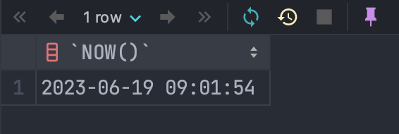
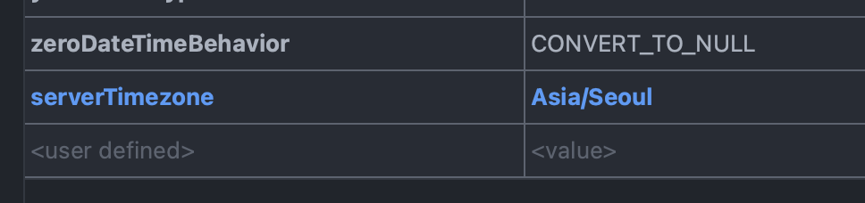
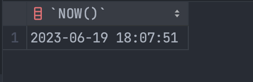
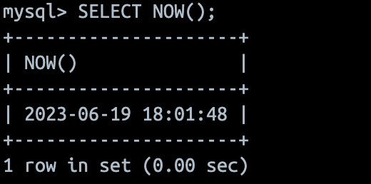

# DataBase

## Table of Content
- [DataBase](#database)
    - [UUID to BIN](#uuid-to-bin)
    - [Docker와 IDE DataBase Table 간의 시간이 맞지 않아요...ㅠ](#docker와-ide-database-table-간의-시간이-맞지-않아요ㅠ)

## UUID to BIN
UUID를 Binary 타입으로 넣기 위해서는 MySQL 자체적으로 있는 함수인 `UUID_TO_BIN()`를 사용하면 됩니다.

- **관련 자료:**
    - [MySQL: convert between UUID and binary](https://remarkablemark.org/blog/2020/05/21/mysql-uuid-bin/)
    - [MySQL UUID_TO_BIN and BIN_TO_UUID Functions](https://mysqlcode.com/mysql-uuid_to_bin-and-bin_to_uuid/)
    - [12.23 Miscellaneous Functions](https://dev.mysql.com/doc/refman/8.0/en/miscellaneous-functions.html#function_uuid-to-bin)

```sql
INSERT INTO users(
    id, email, password, nickname,created_at, edited_at
) VALUES (UUID_TO_BIN(?), ?, ?, NOW(), NOW());
```

## Docker와 IDE DataBase Table 간의 시간이 맞지 않아요...ㅠ
GoLand와 MySQL(on Docker)를 기준으로 합니다.  
GoLand에서 데이터베이스를 접속한 경우 데이터베이스 설정에서 `Advanced`에서 `serverTimezone`에서 `Asia/Seoul`를 추가해 주시면 정상적으로 올바른 시간이 나오게 됩니다.

추가적으로 데이터베이스 상에서 데이터베이스 `time_zone`을 설정해 주시면 한국(서울) 기준을 설정하실 수 있습니다.

```sql
SET GLOBAL time_zone='Asia/Seoul';
SET time_zone='Asia/Seoul';
mysql> select @@global.time_zone, @@session.time_zone;
+--------------------+---------------------+
| @@global.time_zone | @@session.time_zone |
+--------------------+---------------------+
| Asia/Seoul         | Asia/Seoul          |
+--------------------+---------------------+
1 row in set (0.00 sec)
```










##  Scan error on column index 5, name "created_at": unsupported Scan, storing driver.Value type []uint8 into type *time.Time
```
<account>:<password>@tcp(adr)/<database>
```

```
<account>:<password>@tcp(adr)/<database>?parseTime=true
```
`?parseTime=true`를 추가적으로 입력해 주면 정상적으로 불러와집니다.

[unsupported Scan, storing driver.Value type []uint8 into type *time.Time](https://stackoverflow.com/questions/45040319/unsupported-scan-storing-driver-value-type-uint8-into-type-time-time)