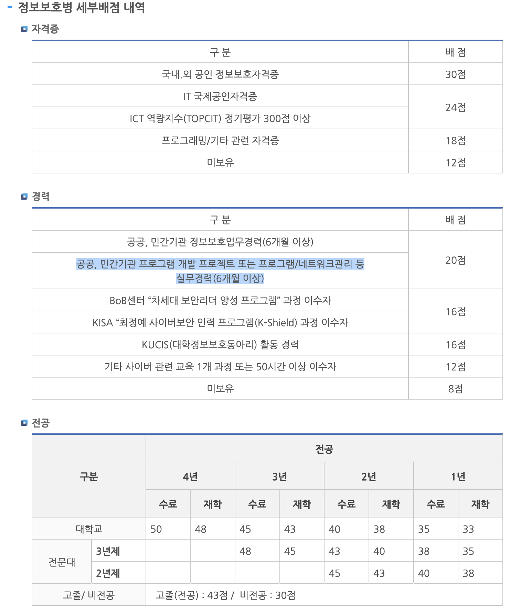

# 20230731 - 군 복무 관련
> 군 복무와 관련되어서 기록할 겸 남겨둔다.  
> **결론 "군대 가기 싫다...ㅠ"**

## 해야할 것들.

### 군대 가기 전 해외여행
- 군대 가기 전에 해외여행
    - 홍콩, 싱가폴, 미국 중 한 곳.
- 출국을 못하는 경우 한국에서 여행할 예정.

### 신변 정리
- **회사**
    - 사직원 제출
    - 재직 중 개발한 프로젝트 문서화 및 유지보수 사항에 대해 정의한 문서 필요함.
- **커뮤니티** 
    - 군대 제대 이후 활동할 수 있도록 커뮤니티 분들께 물어보기.
    - GDG 관련하여 Goolge Korea DevRel팀 담당자 분과 이야기 나눠야 함.  
        - 최대한 다른 분들께 피해가 가지 않도록 해야함.

### 면접 준비

## 육군
### 정보보호병
- **자격 증명:**
    - *정보보호, 정보보안, 해킹방어 등 정보보호관련 학과 전공자*
    - *국외·국내 정보보호 전문 자격증을 취득한 사람*
        - 국제공인정보시스템보안전문가(CISSP), 사이버포렌식전문가(CCFP), 정보보호관리사(CISM), 정보시스템감시사(CISA), 정보보안기사, 디지털포렌식전문가, 인터넷보안전문가, 정보보안관리사(ISM), 해킹보안전문가, 정보보안산업기사, 디지털포렌식전문가2급, 인터넷보안전문가2급, 해킹보안전문가2급, CCNA, 정보처리(기능사 이상), 전자계산기(기능사 이상), 전자계산기조직응용(기능사 이상), 네트워크관리사
- **지원제한 대상:**
    - *범죄경력 조회결과(경찰청)*
        - 징역 또는 금고의 형의 실형(집행유예 포함)을 선고 받은 사람
        - 수사또는 재판중에 있는 사람
        - 처분미상으로 통보된 사람
- **구비 서류:**
    - **제출할 서류.** 최종 학력증명서(재학, 졸업 등) 1부, 고교생활기록부 사본 1부, 자격증 사본 1부(해당자만 제출), 경력증명서 1부(해당자만 제출)

## 해군
### 정보보호병(전문특기병)
- **지원 자격:**
    - **다음 자격증 소지자:** 국내.외 공인 정보보호자격증, IT 국제공인자격증, 프로그래밍/기타 관련 자격증, ICT 역량지수(TOPCIT) 정기평가 300점 이상
    - **다음 관련학과 전공자:** 
        - 4년제 대학, 전문대학 : 정보보호, 컴퓨터, 전산 관련 학과 1년 수료이상
        - 고등학교 : 정보보호 관련 학과 졸업자
    - **임무:**
        - 사이버 보호, 서버/네트워크 관리 등

### S/W개발병(전문특기병)
- **지원 자격:**
    - **자격:** 정보처리기사(산업기사, 기능사), 시각디자인기사(산업기사), 웹디자인기능사
    - **전공:** 컴퓨터공학, 컴퓨터시스템, 공학, 디지털미디어, 시각디자인, 멀티미디어, 전산학
    - **임무:**

## 공군
### 정보보호병
- 자원자격 : 다음 자격요건 중 한가지 이상을 충족하는 자
    - 전공
        - 4년제 대학교 또는 전문대학에서 정보보호 및 컴퓨터(전산) 관련학과 전공자 (1년 수료 이상)
        - 고등학교 졸업자 중 정보보호 또는 컴퓨터(전산)학과 전공자
    - 자격증
        - 정보보호 : 정보보안기사·산업기사, 정보보호전문가, 디지털포렌식전문가 등
        - 정보기술 : 정보처리기사·산업기사 등
    - 업무경력 : 공공, 민간기관 정보보호 업무경력(6개월 이상자)
    - 기타
        - IT 역량지수(TOPCIT) 정기평가 300점이상 획득자
        - BoB센터 "차세대 보안리더 양성 프로그램"과정 선발자
- 선발전형
    1. 1차 : 출결+가산점의 합계 고득점자 순 300% 선발
    2. 2차 : 공군 특별전형 실시(전공 35점+자격 30점+경력 5점+전문교육 5점+면접 25점)
    3. 최종 : 공군 특별전형 평가결과 합격자에 한하여 최종선발 대상에 포함됨

### IT개발관리병